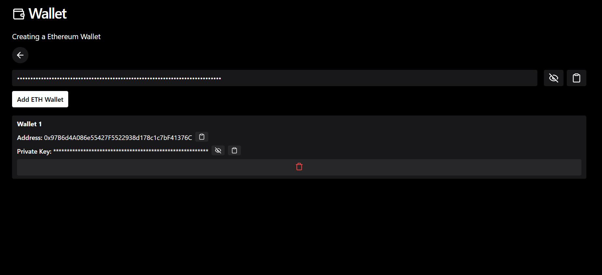

# Web-Based Wallet

A web-based cryptocurrency wallet that supports Ethereum (ETH) and Solana (SOL). It allows users to generate wallet addresses and view their associated private keys. The wallet also provides the ability to copy addresses/keys and toggle the visibility of private keys.

## Features

- **ETH Wallet**: Generate and manage Ethereum wallet addresses.
- **SOL Wallet**: Generate and manage Solana wallet addresses.
- **Seed Phrase**: Generate a BIP39 mnemonic (seed phrase) to derive wallet addresses.
- **Copy**: Copy wallet addresses or private keys to the clipboard.
- **Toggle Private Key Visibility**: View or hide private keys for security.
- **Delete Wallet**: Remove wallet addresses from the UI.

## Dependencies

This project uses the following libraries:

- `@solana/web3.js` - Solana JavaScript API.
- `bip39` - BIP39 mnemonic phrase generation.
- `buffer` - Provides a global `Buffer` object in the browser.
- `ed25519-hd-key` - Ed25519 HD wallet key derivation.
- `ethers` - Ethereum JavaScript library.
- `lucide-react` - React icons for user interface.
- `tweetnacl` - NaCl cryptographic library for Solana key generation.
- `vite` - Next-generation frontend tooling.
- `tailwindcss` - Utility-first CSS framework for styling.

## Contributions
Feel free to fork the repository and submit pull requests if you'd like to contribute to the project. Make sure to follow the coding style conventions and run the linting checks before submitting.

## License
This project is licensed under the MIT License - see the LICENSE file for details.

## Demo

### Key Sections:
- **Features**: Describes the main functionalities of the wallet.
- **Dependencies**: Lists all dependencies required for the project.
- **Project Setup**: Provides installation and setup instructions.
- **Development**: Explains how to run the app in development mode.
- **Build**: Instructions for building the project for production.
- **Linting**: How to run ESLint checks.
- **Screenshots**: Placeholder for adding images if available.
- **Contributions**: Instructions for contributing to the project.
- **License**: Standard section for project licensing.

